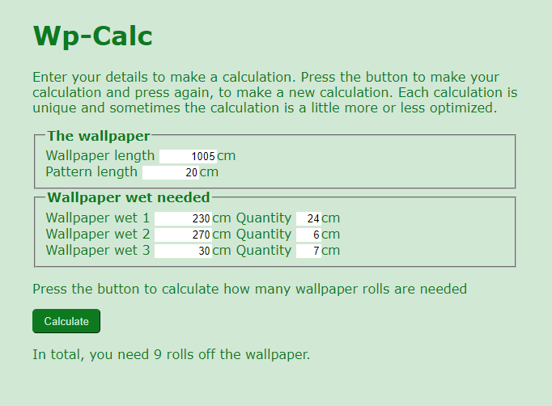

# WP-Calc - 1.0
Simple web-based program that calculates the number of wallpaper rolls you need

## Clone
``git clone https://github.com/WebDevSwe/WP-Calc.git``

## How to use
This wallpaper calculator is a standalone web-based software that you can do on your computer without installing anything.

Download and double-click on the index.html file, to launch the interface and start doing your calculations.

## How it works
You first enter your information about the wallpapers and how many lengths of different sizes you need. The program then tests to match wallpaper lengths in different ways and arrives at the most optimal use of the wallpaper rolls.

Do the calculation several times if you are not satisfied with the result.

### Note
The program will not make you use the wallpaper rolls in the most optimal way, so order at least one extra roll so you do not have to stand without the wallpaper on a late Sunday evening with glue running on the walls.

## Web technology
The program uses JavaScript, HTML5 and CSS3